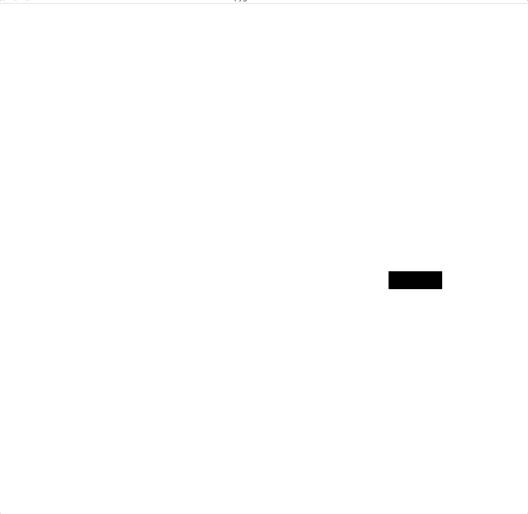
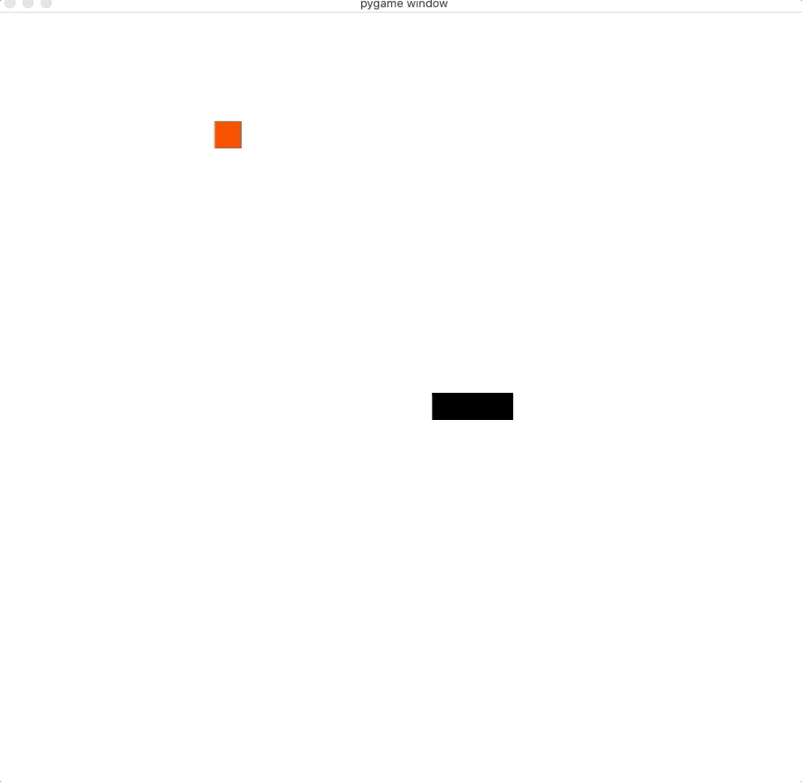

--------------------------------------------------------------------------------

🙏 Projet original par Aurélien Noce ([@ushu](https://github.com/ushu)).

--------------------------------------------------------------------------------

Introduction
--------------------------------------------------------------------------------

Ce TP vous propose de développer un petit jeu en Python. Il constitue 
une introduction à la conception et à la réalisation d'un programme complet.

Son sujet est un classique du jeu vidéo : le 🐍 [snake].
Si vous ne connaissez pas son principe, prenez un moment pour 
découvrir [slither.io](http://slither.io/), 
qui en est est une version moderne ... et complexe ! 

[Snake]: https://fr.wikipedia.org/wiki/Snake_(genre_de_jeu_vid%C3%A9o)


Notre objectif sera plus modeste (et plus proche des versions anciennes du jeu) :
nous réaliserons plusieurs versions d'un **programme qui marche** 
(et pas un programme parfait) dont les fonctionnalités s'enrichiront à
chaque nouvelle étape. 

Prérequis
--------------------------------------------------------------------------------

⚠️ Ce qui suit suppose que vous avez installé Python avec `conda`
et que vous avez un terminal `bash` fonctionnel sur votre ordinateur.

Commencez par créer un environnement nommé `snake`, dédié au TP et 
contenant Python 3.9

```bash
(base) $ conda create -n snake python=3.9
```

Puis activez-le

```bash
(base) $ conda activate snake
```

Vous devriez alors avoir une nouvelle invite de commmande :

```
(snake) $
```

<details>
<summary>
**Dépannage 🛠️** 
</summary>

--------------------------------------------------------------------------------

Si vous ne voyez pas l'invite de commande `(snake) $` alors

1. exécutez la commande

   ```bash
   $ conda init bash
   ```

   puis

2. créez un nouveau terminal.

--------------------------------------------------------------------------------

</details>

Installez ensuite le module `pygame` avec `pip` dans cet environnement :

```bash
(snake) $ pip install pygame
```

Pour tester votre installation, lancez le programme d'exemple :

```bash
(snake) $ python -m pygame.examples.aliens
```

Avec Visual Studio Code
--------------------------------------------------------------------------------

**Suggestion #1.**  Installez l'[extension de VS Code pour Python](https://marketplace.visualstudio.com/items?itemName=ms-python.python).

**Suggestion #2.** Indiquez à VS Code (et pas uniquement au terminal) 
qu'on souhaite travailler dans l'environnement conda `snake` :
cliquez dans la bannière du bas la zone qui indique le Python courant.


Code de démarrage
--------------------------------------------------------------------------------

Notre point de départ : un arrière-plan dont la couleur varie aléatoirement.

```python
import random
import pygame

pygame.init()
screen = pygame.display.set_mode([300, 300])
clock = pygame.time.Clock()

while True:
    red = random.randint(0, 255)
    green = random.randint(0, 255)
    blue = random.randint(0, 255)
    color = [red, green, blue]
    screen.fill(color)
    pygame.display.update()
    clock.tick(1.0)
```

Copiez ce code dans un fichier `snake.py` et exécutez-le :

```sh
(snake) $ python snake.py
```

⚠️ Pour quitter le programme tapez Control-C dans le terminal.


### Exercices

  - 🗔 **Fenêtre.**  Agrandissez la fenêtre du jeu -- initialement 300x300 --
    pour adopter une taille de votre choix.

  - ⏲️ **Horloge.** Dans l'appel à la fonction `clock.tick`,
    
      - remplacez l'argument `1.0` par `0.2` (puis exécutez le programme),
      
      - procédez de même avec `5.0`,

      - puis supprimez (ou commentez) l'appel à `clock.tick`.

    Que se passe-t'il dans chaque cas ? 
    A votre avis, quel est le rôle de la fonction `clock.tick` 
    et de son argument ?

  - 🖌️ **Affichage.** 
    Que se passe-t'il si l'on commente la ligne `pygame.display.update()` ?
    Savez-vous expliquer ce phénomène ?

  - 🎨 **Couleurs.** Faites en sorte que les couleurs qui s'affichent
    soient toujours aléatoires, mais uniquement parmi des nuances de bleu.

    <details>
    <summary> 
    **Code RGB ℹ️**
    </summary>
    --------------------------------------------------------------------------------

    La couleur d'un pixel est décrite par son [code RGB](https://fr.wikipedia.org/wiki/Rouge_vert_bleu) : un triplet d'entiers compris entre 0 et 255 qui déterminent
    l'intensité des composantes rouge, verte et bleue de la couleur. 
    On a par exemple :

            R           G           B    Couleur
    ----------  ----------  ----------  ----------- 
          255           0           0      🟥
            0         255           0      🟩
            0           0         255      🟦
          255         255         255      ⬜
            0           0           0      ⬛
          128          64           0      🟫
          255         128           0      🟧
          255         255           0      🟨
          106          13         173      🟪
            
    --------------------------------------------------------------------------------

    </details>


Événements
--------------------------------------------------------------------------------

Pygame permet de spécifier comment réagir aux actions de l'utilisateur,
par exemple son utilisation du clavier ou de la souris.

Nous pouvons ainsi faire en sorte de forcer l'arrêt du programme lorsque
l'utilisateur clique sur le bouton de fermeture de la fenêtre ou appuie sur
la touche Q :

```python
import random
import sys
import pygame

pygame.init()
screen = pygame.display.set_mode([300, 300])
clock = pygame.time.Clock()

while True:
    for event in pygame.event.get():
        if event.type == pygame.QUIT:
            pygame.quit()
            sys.exit()
        elif event.type == pygame.KEYDOWN:
            if event.key == pygame.K_q:
                pygame.quit()
                sys.exit()
    red = random.randint(0, 255)
    green = random.randint(0, 255)
    blue = random.randint(0, 255)
    color = [red, green, blue]
    screen.fill(color)
    pygame.display.update()
    clock.tick(1.0)
```

Modifier ce programme pour que lorsque l'utilisateur presse 
les flêches de son clavier, le programme affiche (avec la fonction `print`) 
les caractères `←`, `↑`,  `→` ou `↓` dans le terminal.

🗝️ Le code renvoyé par la flêche vers le haut est `pygame.K_UP` par exemple.

Le damier
--------------------------------------------------------------------------------

Nous allons commencer par construire notre plateau de jeu ainsi :

- le plateau de jeu est découpé en 30x30 cases,

- chaque case fait 20 pixels de côté.

Pour vérifier la validité de ce plateau de jeu, 
écrivez un programme qui dessine un damier :


🗝️ Vous pouvez utiliser la méthode [`pygame.draw.rect`](https://www.pygame.org/docs/ref/draw.html#pygame.draw.rect) :

```python
x = 100
y = 100
width = 30
height = 30
rect = [x, y, width, height]
red = 255
green = 0
blue = 0
color = [red, green, blue]
pygame.draw.rect(screen, color, rect)
```

Un serpent fixe
--------------------------------------------------------------------------------

L'étape suivante est de dessiner le serpent, comme une suite de segments
représentés par des rectangles colorés.
On veut dessiner le serpent aux coordonnées suivantes :

```python
snake = [
    [10, 15],
    [11, 15],
    [12, 15],
]
```

pour obtenir un schéma comme suit ; 
disons pour fixer les idées que dans ce cas de figure `[10, 15]` est la queue
et `[12, 15]` est la tête :


<details>
<summary>
**Solution**
</summary>
```python
import sys
import pygame

white = [255, 255, 255]
black = [0, 0, 0]
snake = [
    [10, 15],
    [11, 15],
    [12, 15],
]

pygame.init()
screen = pygame.display.set_mode([20*30, 20*30])
clock = pygame.time.Clock()
while True:
    for event in pygame.event.get():
        if event.type == pygame.QUIT:
            sys.exit()
        elif event.type == pygame.KEYDOWN:
            if event.key == pygame.K_q:
              sys.exit()
    screen.fill(white)
    for x, y in snake:
        rect = [x*20, y*20, 20, 20]
        pygame.draw.rect(screen, black, rect)    
    pygame.display.update()
    clock.tick(1.0)
```

</details>


Un serpent qui bouge
--------------------------------------------------------------------------------

Ensuite, nous allons faire bouger le serpent :

- nous créons un vecteur de "direction", par exemple
  
  ```python
  direction = [1, 0]
  ```

- à chaque itération de la boucle, nous pouvons déplacer le serpent dans 
  cette direction en "ajoutant" ce vecteur à la position de la tête du serpent



Une fois que le serpent bouge, ajouter les commandes pour se déplacer dans 
les 4 directions, en appuyant sur les touches de direction du clavier.

Aussi on peut commencer à envisager d'accélérer un peu le jeu à ce stade ...

**Bonus.** Faites en sorte que le serpent ne puisse pas faire demi-tour.

<details>
<summary>
**Solution**
</summary>

```python
import sys
import pygame

white = [255, 255, 255]
black = [0, 0, 0]
snake = [
    [10, 15],
    [11, 15],
    [12, 15],
]
direction = [1, 0]

pygame.init()
screen = pygame.display.set_mode([20*30, 20*30])
clock = pygame.time.Clock()
while True:
    for event in pygame.event.get():
        if event.type == pygame.QUIT:
            pygame.quit()
            sys.exit()
        elif event.type == pygame.KEYDOWN:
            if event.key == pygame.K_q:
                pygame.quit()
                sys.exit()
            if event.key == pygame.K_UP:
                direction = [0.0, -1.0]
            elif event.key == pygame.K_LEFT:
                direction = [-1.0, 0.0]
            elif event.key == pygame.K_DOWN:
                direction = [0.0, 1.0]
            elif event.key == pygame.K_RIGHT:
                direction = [1.0, 0.0]
    head = snake[-1]
    new_head = [
      head[0] + direction[0], 
      head[1] + direction[1]
    ]
    snake = snake[1:] + [new_head]
    screen.fill(white)
    for x, y in snake:
        rect = [x*20, y*20, 20, 20]
        pygame.draw.rect(screen, black, rect)  
    pygame.display.update()
    clock.tick(1.0)
```

</details>


Le fruit
--------------------------------------------------------------------------------

Il faut maintenant faire manger notre serpent.
On va procéder comme suit:

  - on a toujours la position du serpent dans une variable `snake` :

  - on génère un "fruit", dans une position aléatoire

    ```python
    fruit = [10, 10]
    ```

  - quand la tête du serpent mange le fruit, 
    on place un nouveau fruit à une position aléatoire 
    et on allonge le serpent d'une case

    

<details>
<summary>
**Solution**
</summary>


```python
import random
import sys
import pygame

white = [255, 255, 255]
black = [0, 0, 0]
red = [255, 0, 0]
snake = [
    [10, 15],
    [11, 15],
    [12, 15],
]
direction = [1, 0]
fruit = [10, 10]

pygame.init()
screen = pygame.display.set_mode([20*30, 20*30])
clock = pygame.time.Clock()
while True:
    for event in pygame.event.get():
        if event.type == pygame.QUIT:
            pygame.quit()
            sys.exit()
        elif event.type == pygame.KEYDOWN:
            if event.key == pygame.K_q:
                pygame.quit()
                sys.exit()
            if event.key == pygame.K_UP:
                direction = [0, -1]
            elif event.key == pygame.K_LEFT:
                direction = [-1, 0]
            elif event.key == pygame.K_DOWN:
                direction = [0, 1]
            elif event.key == pygame.K_RIGHT:
                direction = [1, 0]
    head = snake[-1]
    new_head = [
      head[0] + direction[0], 
      head[1] + direction[1]
    ]
    if new_head == fruit:
        snake = snake + [new_head]
        fruit = [
            random.randint(0, 29), 
            random.randint(0, 29)
        ]
    else:
        snake = snake[1:] + [new_head]
    screen.fill(white)
    for x, y in snake:
        rect = [x*20, y*20, 20, 20]
        pygame.draw.rect(screen, black, rect)
    rect = [fruit[0]*20, fruit[1]*20, 20, 20]
    pygame.draw.rect(screen, red, rect)  
    pygame.display.update()
    clock.tick(1.0)
```

</details>


Épilogue
--------------------------------------------------------------------------------

Il nous reste deux petits changements pour avoir un serpent complètement 
fonctionnel :

- Il faut détecter si le serpent se mord la queue, ou touche un
  des murs, ce qui est une condition d'échec.

- Enfin on peut afficher le score.
  La façon la plus simple de procéder est de changer le titre de la fenêtre, 
  avec la fonction `set_caption` :
  ```python
  score = 0
  pygame.display.set_caption(f"Score : {score}")
  ```


<details>
<summary>
**Solution**
</summary>

```python
import random
import sys
import pygame

white = [255, 255, 255]
black = [0, 0, 0]
red = [255, 0, 0]
snake = [
    [10, 15],
    [11, 15],
    [12, 15],
]
direction = [1, 0]
fruit = [10, 10]
score = 0

pygame.init()
screen = pygame.display.set_mode([20*30, 20*30])
clock = pygame.time.Clock()
while True:
    for event in pygame.event.get():
        if event.type == pygame.QUIT:
            pygame.quit()
            sys.exit()
        elif event.type == pygame.KEYDOWN:
            if event.key == pygame.K_q:
                pygame.quit()
                sys.exit()
            if event.key == pygame.K_UP:
                direction = [0, -1]
            elif event.key == pygame.K_LEFT:
                direction = [-1, 0]
            elif event.key == pygame.K_DOWN:
                direction = [0, 1]
            elif event.key == pygame.K_RIGHT:
                direction = [1, 0]
    head = snake[-1]
    new_head = [
      head[0] + direction[0], 
      head[1] + direction[1]
    ]
    if new_head in snake:
        sys.exit()
    elif new_head[0] < 0 or new_head[0] >= 30:
        sys.exit()
    elif new_head[1] < 0 or new_head[1] >= 30:
        sys.exit()
    if new_head == fruit:
        score = score + 1
        snake = snake + [new_head]
        fruit = [
            random.randint(0, 29), 
            random.randint(0, 29)
        ]
    else:
        snake = snake[1:] + [new_head]
    screen.fill(white)
    for x, y in snake:
        rect = [x*20, y*20, 20, 20]
        pygame.draw.rect(screen, black, rect)
    rect = [fruit[0]*20, fruit[1]*20, 20, 20]
    pygame.draw.rect(screen, red, rect)  
    pygame.display.update()
    pygame.display.set_caption(f"Score: {score}")
    clock.tick(1.0)
```

</details>
